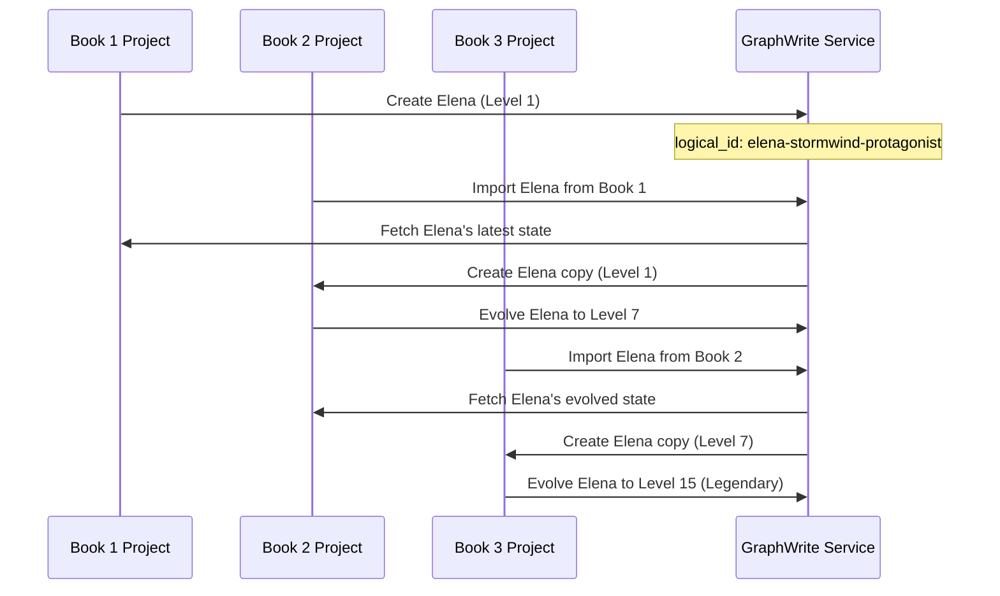

# Cross-Project Entity Continuity

## Overview

Libretto's Cross-Project Entity Continuity system enables characters, locations, and other narrative elements to maintain their identity and evolution across multiple related projects. This allows creators to build epic multi-book series, shared universes, and interconnected narratives where "Elena must always be Elena" regardless of which story she appears in.

## Core Principle: "Elena Must Always Be Elena"

The fundamental principle driving this system is that narrative entities should maintain their core identity while allowing for natural growth and evolution. When Elena appears in Book 1 as a young archaeologist and later in Book 3 as a legendary hero, she remains the same character with a continuous development arc.

## Key Features

### 1. Stable Logical Identities

Every entity receives a stable logical identifier that persists across all projects and versions:

```
elena-stormwind-protagonist    # Stable across all books
marcus-ironforge-companion     # Appears in multiple projects  
ancient-temple-of-echoes      # Shared location across stories
```

### 2. Cross-Project Import System

Import entities from other projects while preserving their complete state:

```go
// Import Elena from Book 1 into Book 2
importedElena, err := service.ImportEntity(ctx, book2VersionID, book1ProjectID, "elena-stormwind-protagonist")

// Elena brings her Level 5 state, skills, relationships, and character development
```

### 3. Entity Evolution Tracking

Track character development across the entire narrative universe:

```go
// Get Elena's complete journey across all projects
elenaHistory, err := service.GetEntityHistory(ctx, "elena-stormwind-protagonist")

// Returns:
// Book 1: Level 1, Age 22, Role: archaeologist
// Book 2: Level 7, Age 25, Role: war_leader  
// Book 3: Level 15, Age 28, Role: legendary_hero
```

### 4. Shared Entity Analytics

Identify and analyze entities that span multiple projects:

```go
// Find all characters appearing in multiple books
sharedEntities, err := service.ListSharedEntities(ctx)

// Returns entities with their project appearances and evolution stats
```

## Architecture

### Dual-Identity System

The system uses a dual-identity approach to balance narrative continuity with database integrity:

- **Logical IDs**: Human-readable, stable identifiers for narrative continuity
- **Database IDs**: Technical UUIDs for database constraints and performance
- **Runtime Mapping**: Translation between logical and database IDs within version contexts

### Entity Lifecycle



## Use Cases

### Epic Multi-Book Series

**The Chronicles of Elena Stormwind:**
- Book 1: Elena starts as Level 1 archaeologist
- Book 2: Elena imported as Level 1, evolves to Level 7 war leader
- Book 3: Elena imported as Level 7, becomes Level 15 legendary hero

Each book builds on the previous character development while maintaining narrative continuity.

### Shared Universe Stories

**Marvel-Style Interconnected Universe:**
- Iron Man appears in his solo movies
- Iron Man imported into Avengers movies
- Character development and relationships persist across all appearances

### Prequel/Sequel Continuity

**Star Wars-Style Timeline:**
- Obi-Wan in Prequel Trilogy (young Jedi)
- Obi-Wan in Original Trilogy (wise mentor)
- Same character, different life stages, continuous identity

### Collaborative World-Building

**Multiple Authors, Shared Characters:**
- Author A creates Elena in "The Lost Artifact"
- Author B imports Elena into "The Shadow War" spin-off
- Elena's core identity preserved while allowing new story directions

## Implementation Details

### Entity Data Structure

```json
{
  "logical_id": "elena-stormwind-protagonist",
  "name": "Elena Stormwind",
  "level": 7,
  "age": 25,
  "skills": ["archaeology", "leadership", "combat_magic"],
  "cross_project_metadata": {
    "imported_from_project": "book1_project_id",
    "import_timestamp": "2025-01-15T10:30:00Z",
    "first_appeared": "Book 1: The Lost Artifact",
    "total_appearances": 2,
    "projects": ["Book 1: The Lost Artifact", "Book 2: The Shadow War"]
  }
}
```

### Database Schema

```sql
-- Entities maintain logical IDs in their data
CREATE TABLE entities (
    id TEXT PRIMARY KEY,           -- Database UUID (unique per version)
    version_id TEXT NOT NULL,      -- Which version this belongs to
    entity_type TEXT NOT NULL,     -- Character, Location, etc.
    name TEXT NOT NULL,
    data JSON NOT NULL,            -- Contains logical_id and cross-project metadata
    created_at DATETIME DEFAULT CURRENT_TIMESTAMP,
    updated_at DATETIME DEFAULT CURRENT_TIMESTAMP
);

-- Logical ID stored in data JSON:
-- {"logical_id": "elena-stormwind-protagonist", ...}
```

### API Operations

```go
// Import entity from another project
func (s *Service) ImportEntity(
    ctx context.Context, 
    targetVersionID string, 
    sourceProjectID string, 
    entityLogicalID string
) (*Entity, error)

// Get entity's complete cross-project history
func (s *Service) GetEntityHistory(
    ctx context.Context, 
    entityLogicalID string
) ([]*EntityVersion, error)

// List entities appearing in multiple projects
func (s *Service) ListSharedEntities(
    ctx context.Context
) ([]*SharedEntity, error)
```

## Benefits

### For Creators

- **Narrative Continuity**: Characters maintain identity across stories
- **Character Development**: Natural evolution spanning multiple projects
- **World Building**: Consistent locations and lore across universe
- **Creative Freedom**: Experiment with character arcs across multiple stories

### For Readers/Audiences

- **Familiar Characters**: Beloved characters appear across multiple stories
- **Character Growth**: Witness long-term character development arcs
- **Universe Coherence**: Consistent world-building and character relationships
- **Epic Storytelling**: Grand narratives spanning multiple books/movies/games

### For Collaborative Teams

- **Shared Assets**: Multiple authors can use the same characters
- **Consistency**: Automated tracking prevents character inconsistencies
- **Provenance**: Clear tracking of which project created which entities
- **Conflict Resolution**: Tools to merge different versions of characters

## Best Practices

### Logical ID Naming

Use descriptive, stable identifiers:
```
✅ elena-stormwind-protagonist
✅ marcus-ironforge-companion  
✅ ancient-temple-of-echoes
✅ sword-of-eternal-flame

❌ char_001
❌ temp_character
❌ elena_v2
```

### Character Evolution

Preserve core identity while allowing growth:
```json
// Good: Elena grows but remains Elena
{
  "logical_id": "elena-stormwind-protagonist",
  "name": "Elena Stormwind, the Lightbringer",  // Title added
  "level": 15,                                  // Evolved from Level 1
  "core_personality": "curious, determined",    // Core traits preserved
  "new_skills": ["divine_magic", "leadership"]  // New abilities gained
}
```

### Import Strategy

Import at logical story transition points:
- Between books in a series
- At the start of spin-off stories  
- When characters cross over between storylines
- For prequel/sequel connections

### Relationship Continuity

Maintain relationship evolution across projects:
```json
{
  "elena_marcus_relationship": {
    "book1": "cautious_allies",
    "book2": "trusted_companions", 
    "book3": "unbreakable_bond"
  }
}
```

## Future Enhancements

### Planned Features

- **Automatic Conflict Detection**: Identify when imported characters have conflicting attributes
- **Character Merge Tools**: UI for resolving character conflicts across projects
- **Universe Analytics**: Dashboards showing character appearances and evolution across projects
- **Template Characters**: Pre-built character archetypes for common narrative roles
- **Relationship Networks**: Visualize character relationship evolution across projects

### Advanced Use Cases

- **Time Travel Stories**: Same character at different time periods
- **Alternate Universes**: Character variants across parallel storylines
- **Character Genealogy**: Family relationships spanning generations of stories
- **Collaborative Universes**: Multiple creators contributing to shared narrative worlds

## Conclusion

Cross-Project Entity Continuity transforms Libretto from a single-story tool into a comprehensive narrative universe management system. By ensuring "Elena must always be Elena" across all projects, creators can build epic, interconnected stories that rival the greatest narrative universes in literature, film, and gaming.

The system provides the technical foundation for grand storytelling while maintaining the flexibility and creative freedom that makes great narratives possible.