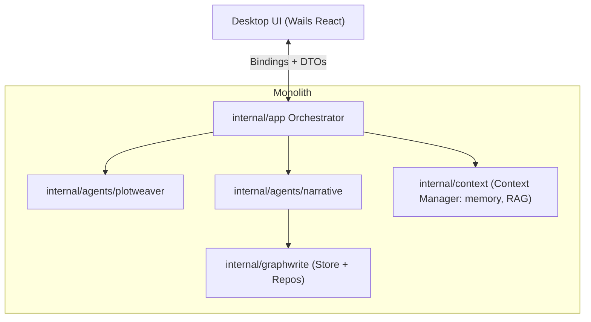
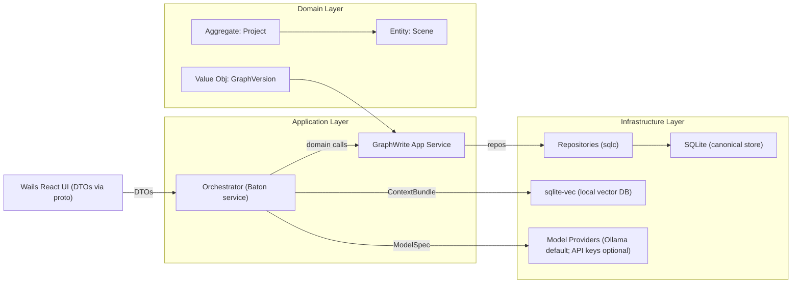
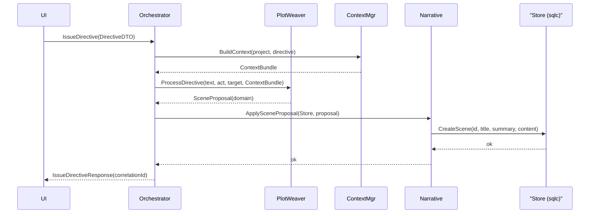
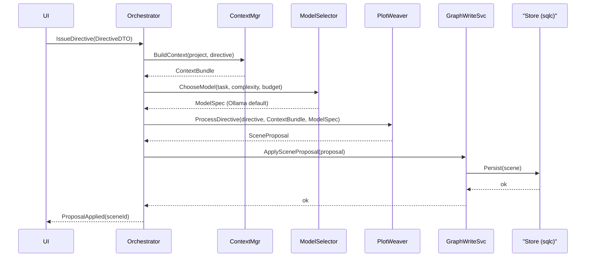

# Domain-Driven Design Overview (MVP)

Status: Proposed

## Ubiquitous Language
- Project: container for scenes and related narrative assets
- Scene: atomic narrative unit with title, summary, content
- Directive: user instruction to agents (text, act, target)
- Scene Proposal: candidate scene derived from a directive

## Bounded Contexts
- Creation: directive -> proposal
- Narrative Graph: storage, indexing, retrieval of scenes (later: acts/beats)
- Rendering/Export: formats (later)

## Module/Container View (Monolith)

## Domain Model and Seams (high level)

### Key seams
- UI ↔ Application: protobuf DTOs for requests/responses (TS/Go generated)
- Application ↔ Domain: method calls with domain types (no proto inside core)
- Domain ↔ Persistence: repository interfaces (sqlc-backed) against SQLite
- Application ↔ Context: Context Manager provides ContextBundle (RAG via sqlite-vec)
- Application ↔ Models: ModelSelector chooses Ollama or API provider based on task/constraints

## Directive → Persisted Scene (Sequence)

### Seams-first sequence (Context + Model selection in loop)

## Proto Seams (DTOs)
- baton.v1: IssueDirectiveRequest/Response
- scene.v1: Scene, SceneList
- context.v1 (later): ContextBundle summary for debugging/telemetry

## Notes on Context Management
- Local Context Manager responsible for:
  - Token budget planning per task
  - Prompt assembly with domain-aware sections (beats, characters, prior scenes)
  - RAG over local vector DB (scoped to project)
  - Model selection policy (Ollama vs API providers)
- Local vector DB options: SQLite+Vec (pgvecto.rs alt), Qdrant (embedded), or Milvus lite; start with sqlite-vec for fewer moving parts.

