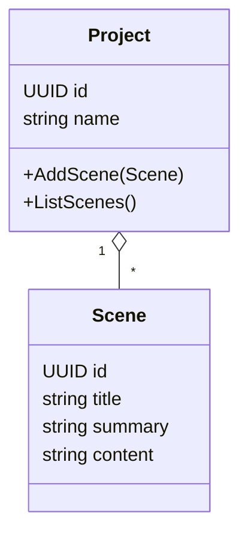

# Domain-Driven Design Overview (MVP)

Status: Proposed

## Ubiquitous Language
- Project: container for scenes and related narrative assets
- Scene: atomic narrative unit with title, summary, content
- Directive: user instruction to agents (text, act, target)
- Scene Proposal: candidate scene derived from a directive

## Bounded Contexts
- Creation: directive -> proposal
- Narrative Graph: storage, indexing, retrieval of scenes (later: acts/beats)
- Rendering/Export: formats (later)

## Module/Container View (Monolith)
```mermaid
flowchart TB
  subgraph Monolith
    App[internal/app Orchestrator]
    Plot[internal/agents/plotweaver]
    Narr[internal/agents/narrative]
    Store[internal/graphwrite (Store + Repos)]
    Ctx[internal/context (Context Manager: memory, RAG)]
  end
  UI[Desktop UI (Wails React)] <---> |Bindings + DTOs| App
  App --> Plot
  App --> Narr
  App --> Ctx
  Narr --> Store
```

## Domain Model (initial)


## Directive → Persisted Scene (Sequence)


## Proto Seams (DTOs)
- baton.v1: IssueDirectiveRequest/Response
- scene.v1: Scene, SceneList
- context.v1 (later): ContextBundle summary for debugging/telemetry

## Notes on Context Management
- Local Context Manager responsible for:
  - Token budget planning per task
  - Prompt assembly with domain-aware sections (beats, characters, prior scenes)
  - RAG over local vector DB (scoped to project)
  - Model selection policy (Ollama vs API providers)
- Local vector DB options: SQLite+Vec (pgvecto.rs alt), Qdrant (embedded), or Milvus lite; start with sqlite-vec for fewer moving parts.

